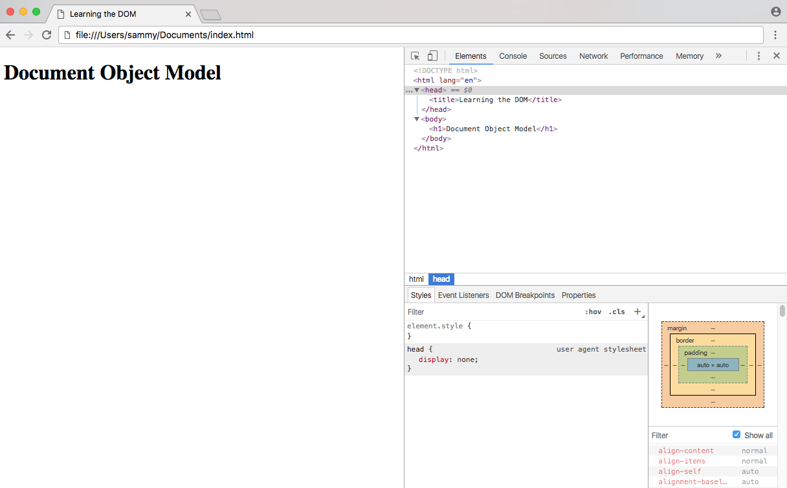
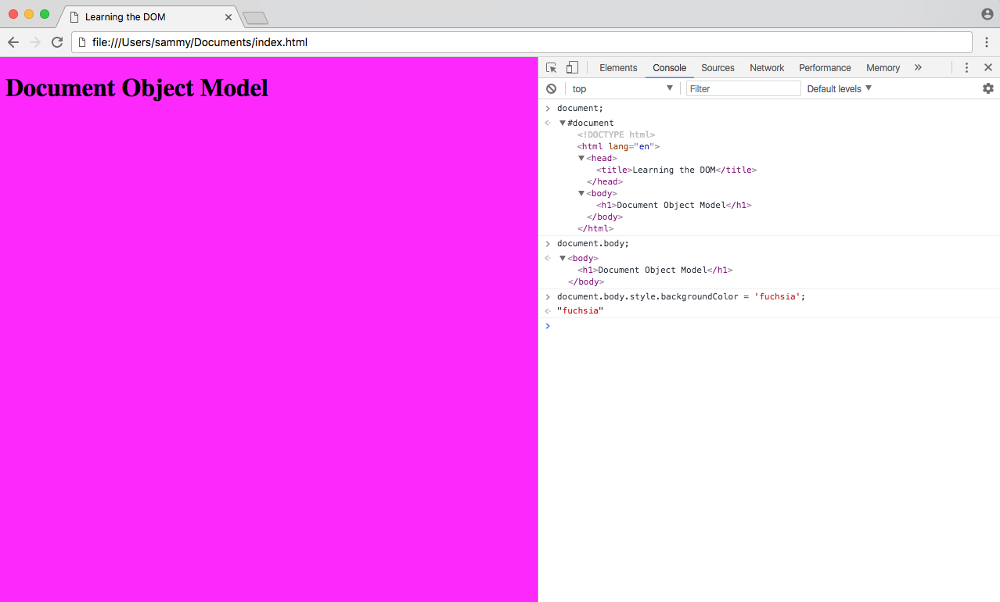

# `What is the DOM?`
At the most basic level, a website consists of an HTML document. The browser that you use to view the website is a program that interprets HTML and CSS and renders the style, content, and structure into the page that you see.

In addition to parsing the style and structure of the HTML and CSS, the browser creates a representation of the document known as the Document Object Model. This `model` allows JavaScript to access the text content and elements of the website `document` as `objects`.

JavaScript is an interactive language, and it is easier to understand new concepts by doing. Let’s create a very basic website. Create an `index.html` file and save it in a new project directory.

```js
<!DOCTYPE html>
<html lang="en">

  <head>
    <title>Learning the DOM</title>
  </head>

  <body>
    <h1>Document Object Model</h1>
  </body>

</html>
```
This code is the familiar HTML source of a new website skeleton. It contains the absolute most essential aspects of a website document — a doctype, and an `html` tag with the `head` and `body` nested inside.

For our purposes, we’ll be using the Chrome browser, but you can receive similar output from other modern browser. Within Chrome, open up `index.html`. You’ll see a plain website with our heading saying “Document Object Model”. Right click anywhere on the page and select **Inspect**. This will open up Developer Tools.

Under the Elements tab, you’ll see the DOM.


In this case, when expanded, it looks exactly the same as the HTML source code we just wrote — a doctype, and the few other HTML tags that we added. Hovering over each element will highlight the respective element in the rendered website. Little arrows to the left of the HTML elements allow you to toggle the view of nested elements.

# `The Document Object`
The `document` object is a built-in object that has many **properties** and **methods** that we can use to access and modify websites. In order to understand how to work with the DOM, you must understand how objects work in JavaScript. Review [Understanding Objects in JavaScript](https://www.digitalocean.com/community/tutorials/understanding-objects-in-javascript) if you don’t feel comfortable with the concept of objects.

In Developer Tools on index.html, move to the Console tab. Type document into the console and press ENTER. You will see that what is output is the same as what you see in the Elements tab.

In Developer Tools on **index.html**, move to the Console tab. Type `document` into the console and press `ENTER`. You will see that what is output is the same as what you see in the Elements tab.

```js
document;
```
Output:

```js
#document
<!DOCTYPE html>
<html lang="en">

  <head>
    <title>Learning the DOM</title>
  </head>

  <body>
    <h1>Document Object Model</h1>
  </body>

</html>
```

Typing `document` and otherwise working directly in the console is not something that you’ll generally ever do outside of debugging, but it helps solidify exactly what the `document` object is and how to modify it, as we will discover below.

## `What is the Difference Between the DOM and HTML Source Code?`
Currently, with this example, it seems that HTML source code and the DOM are the exact same thing. There are two instances in which the browser-generated DOM will be different than HTML source code:
- The DOM is modified by client-side JavaScript
- The browser automatically fixes errors in the source code
  
Let’s demonstrate how the DOM can be modified by client-side JavaScript. Type the following into the console:

```js
document.body;
```
The console will respond with this output:
```js
Output<body>
  <h1>Document Object Model</h1>
</body>
```

`document` is an object, `body` is a property of that object that we have accessed with dot notation. Submitting `document.body` to the console outputs the `body` element and everything inside of it.

In the console, we can change some of the live properties of the `body` object on this website. We’ll edit the `style` attribute, changing the background color to `fuchsia`. Type this into the console:

After typing and submitting the above code, you’ll see the live update to the site, as the background color changes.



Switching to the Elements tab, or typing `document.body` into the console again, you will see that the DOM has changed.

```js
Output<body style="background-color: fuchsia;">
  <h1>Document Object Model</h1>
</body>
```

>**Note**: In order to change the `background-color CSS` property, we had to type `backgroundColor` in the JavaScript. Any hyphenated CSS property will be written in camelCase in JavaScript.

The JavaScript code we typed, assigning `fuchsia` to the background color of the `body`, is now a part of the DOM.

However, right click on the page and select “View Page Source”. You will notice that the source of the website does not contain the new style attribute we added via JavaScript. The source of a website will not change and will never be affected by client-side JavaScript. If you refresh the page, the new code we added in the console will disappear.

The other instance in which the DOM might have a different output than HTML source code is when there are errors in the source code. One common example of this is the `table` tag — a `tbody` tag is required inside a `table`, but developers often fail to include it in their HTML. The browser will automatically correct the error and add the `tbody`, modifying the DOM. The DOM will also fix tags that have not been closed.

## `Conclusion`
In this tutorial, we defined the DOM, accessed the `document` object, used JavaScript and the console to update a property of the `document` object, and went over the difference between HTML source code and the DOM.
 