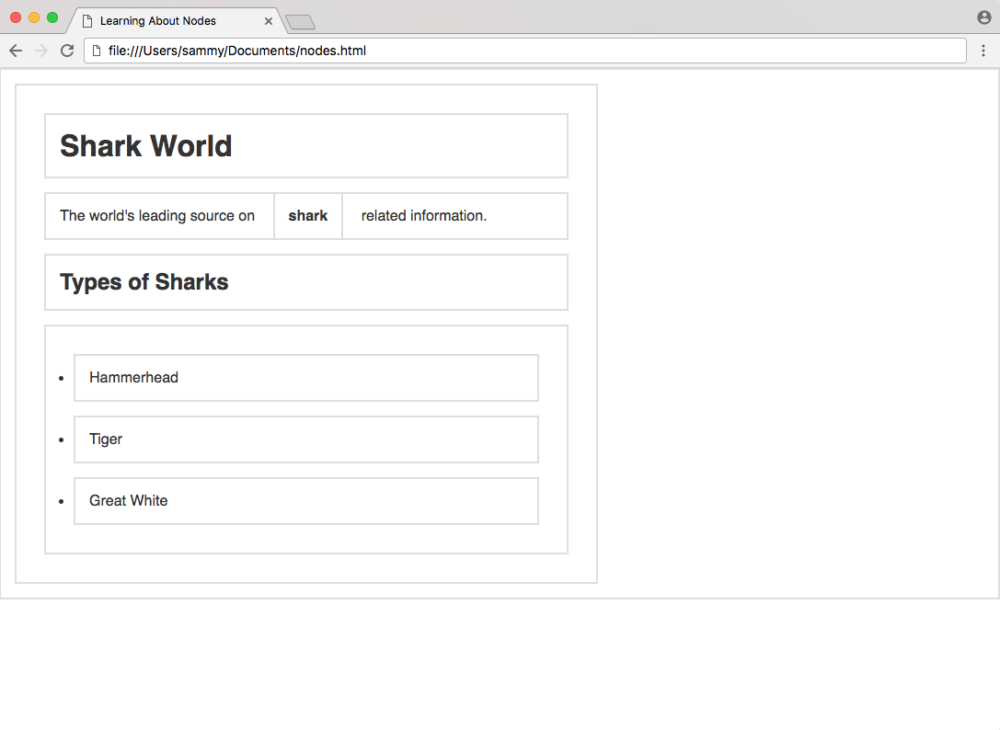

In this tutorial, we will go over how to traverse the DOM (also known as walking or navigating the DOM) with parent, child, and sibling properties.

Setup
To begin, we will create a new file called `nodes.html` comprised of the following code.

```html
<!DOCTYPE html>
<html>

<head>
  <title>Learning About Nodes</title>

  <style>
    * { border: 2px solid #dedede; padding: 15px; margin: 15px; }
    html { margin: 0; padding: 0; }
    body { max-width: 600px; font-family: sans-serif; color: #333; }
  </style>
</head>

<body>
  <h1>Shark World</h1>
  <p>The world's leading source on <strong>shark</strong> related information.</p>
  <h2>Types of Sharks</h2>
  <ul>
    <li>Hammerhead</li>
    <li>Tiger</li>
    <li>Great White</li>
  </ul>
</body>

<script>
  const h1 = document.getElementsByTagName('h1')[0];
  const p = document.getElementsByTagName('p')[0];
  const ul = document.getElementsByTagName('ul')[0];
</script>

</html>
```
When we load the file in a web browser, we’ll see rendering that looks like the following screenshot.



In this example website, we have an HTML document with a few elements.<br/>
Some basic CSS has been added in a `style` tag to make each element obviously visible,<br/> 
and a few variables have been created in the `script` for ease of access of a few elements. Since there is only one of each `h1`, `p`, and `ul`, we can access the first index on each respective `getElementsByTagName` property.

# Root Nodes
The `document` object is the root of every node in the DOM. This object is actually a property of the `window` object, which is the global, top-level object representing a tab in the browser. The `window` object has access to such information as the toolbar, height and width of the window, prompts, and alerts. The `document` consists of what is inside of the inner `window`.

Below is a chart consisting of the root elements that every document will contain. Even if a blank HTML file is loaded into a browser, these three nodes will be added and parsed into the DOM.

| Property | Node | Node Type |
|-|-|-|
| `document`	                | `#document`	| `DOCUMENT_NODE` |
| `document.documentElement`	| `html`	    | `ELEMENT_NODE`  |
| `document.head`	            | `head`	    | `ELEMENT_NODE`  |
| `document.body`	            | `body`	    | `ELEMENT_NODE`  |

Since the `html`, `head`, and `body` elements are so common, they have their own properties on the document.

Open the Console in DevTools and test each of these four properties by submitting them and viewing the output. You can also test `h1`, `p`, and `ul` which will return the elements due to the variables we added in the `script` tag.

## Parent Nodes
The nodes in the DOM are referred to as parents, children, and siblings, depending on their relation to other nodes. The **parent** of any node is the node that is one level above it, or closer to the `document` in the DOM hierarchy. There are two properties to get the parent — `parentNode` and `parentElement`.

| Property | Gets |
|-|-|
| `parentNode` | `Parent Node` |
| `parentElement` | `Parent Element Node` |

In our nodes.html example:
- `html` is the parent of `head`, `body`, and `script`.
- `body` is the parent of `h1`, `h2`, `p` and `ul`, but not `li`, since `li` is two levels down from `body`.

We can test what the parent of our `p` element is with the `parentNode` property. This `p` variable comes from our custom `document.getElementsByTagName('p')[0]` declaration.

```js
p.parentNode;

Output
► <body>...</body>
```
The parent of `p` is `body`, but how can we get the grandparent, which is two levels above? We can do so by chaining properties together.
```js
p.parentNode;

Output
► <html>...</html>
```
Using `parentNode` twice, we retrieved the grandparent of `p`.

There are properties to retrieve the parent of a node, but only one small difference between them, as demonstrated in this snippet below.
```js
// Assign html object to html variable
const html = document.documentElement;

console.log(html.parentNode); // > #document
console.log(html.parentElement); // > null
```
The parent of almost any node is an element node, as text and comments cannot be parents to other nodes. However, the parent of `html` is a document node, so `parentElement` returns `null`. Generally, `parentNode` is more commonly used when traversing the DOM.